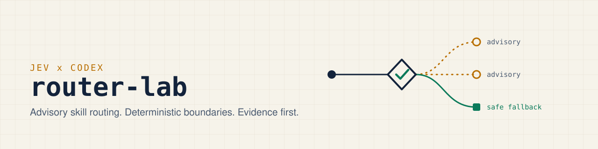

<p align="center">
  <picture>
    <source media="(prefers-color-scheme: dark)" srcset=".github/assets/banner-dark.svg">
    
  </picture>
</p>

[](https://github.com/apolenkov/jev-codex-router-lab/actions/workflows/ci.yml)
[](https://github.com/apolenkov/jev-codex-router-lab/actions/workflows/codeql.yml)
[](https://scorecard.dev/viewer/?uri=github.com/apolenkov/jev-codex-router-lab)
[](LICENSE)
[](package.json)
[](tsconfig.json)

# Jev Codex Router Lab

An experimental TypeScript reference implementation for testing Jev as an
advisory skill-and-context router. Jev proposes typed semantic judgments;
deterministic code validates every boundary, preserves mandatory requirements,
and decides whether to return a result or a safe fallback.


> [!IMPORTANT]
> **Status: research lab.** The code is a reference implementation; the
> evidence is deliberately narrow (see [Current evidence](#current-evidence)):
> one live smoke and one single-observation synthetic smoke. Nothing here
> demonstrates routing quality, savings, or production readiness.

## Why

Letting a language model pick skills and context is cheap to try and hard to
trust. This lab tests a narrow design: the model only advises, typed and
confidence-gated, while deterministic code keeps every guarantee (mandatory
skills, protected context, allowlists, fallback). The point is to measure that
design with recorded evidence, not to assert that it works.

## Features

- Two-pass advisory routing (shortlist, then ranking) with seven typed signals.
- Mandatory skills and protected context are computed before Jev is called and
  cannot be removed by it.
- Typed `fallback` on any error, stale or malformed response, unknown ID, or low
  confidence; pass-1 confidence gate fails closed without configured thresholds.
- Credential-free offline example and an offline, fixture-replay development
  arena.
- Opt-in, capped, create-once evidence collectors; retained smoke and
  calibration summaries under `artifacts/`.

This is a lab, not a production Codex integration. It does not execute skills,
choose between agents, change permissions, or modify a working Codex setup.

## Five-minute offline quickstart

Requirements: Node.js 20.19.0 or newer and npm.

```bash
git clone https://github.com/apolenkov/jev-codex-router-lab.git
cd jev-codex-router-lab
npm ci
npm run example:offline
npm run check
```

The offline example uses a clearly labelled fake gateway. It makes no provider
request, needs no `TYPESAFE_API_KEY`, and is not presented as Jev output. It
demonstrates the contract's important failure invariant: typed fallback keeps
mandatory skill IDs and protected-context IDs. Because no pass-1 threshold
policy is configured, it prints the `uncalibrated-thresholds` fallback.

## What the router returns

An `ok` decision contains seven typed advisory signals:

| Signal | Meaning |
| --- | --- |
| `taskType` | One of `explain`, `research`, `plan`, `diagnose`, `change`, `review`, or `operate` |
| `skillCandidates` | Up to three optional allowlisted skill IDs |
| `criticalGap` | An allowlisted missing fact that blocks safe progress, or `null` |
| `reuseCandidate` | An allowlisted reusable solution ID, or `null` |
| `architectureFork` | An allowlisted consequential choice with alternatives and trade-off, or `null` |
| `riskDimensions` | Probabilities for security, data loss, public contract, migration, and user behavior |
| `contextRelevance` | Probabilities for allowlisted, non-protected context IDs |

`task_type`, `skill_candidates`, `critical_gap`, `reuse_candidate`,
`architecture_fork`, `risk_dimensions`, and `context_relevance` are the
corresponding Jev question groups. The public `RouterDecision` uses the
TypeScript field names shown in the table.

Explicit and policy-required skills are computed before Jev is called. They are
uncapped and returned separately as `forcedSkillIds`; Jev cannot remove them.
Protected context is similarly retained as `protectedContextIds` without being
sent to the semantic layer.

## Trust boundary

```text
allowlisted input
      |
      v
deterministic precheck
      |
      v
Jev pass 1 -- optional shortlist + six other signal groups
      |
      +-- no optional skill --> deterministic postcheck --> decision
      |
      v
Jev pass 2 -- shortlist ranking and independent fit judgments
      |
      v
deterministic postcheck --> ok or typed fallback
```

The deterministic layer owns input limits, allowlists, stale-response checks,
mandatory skills, protected context, response-shape validation, and fallback.
Jev is untrusted advisory input. Errors, malformed or stale responses, unknown
IDs, and low confidence produce a typed `fallback`; they do not grant the model
authority or trigger execution.

Pass 1 applies an atomic confidence gate over every queried non-echo answer: a
Choice confidence below the configured floor or a Noul probability inside the
configured inclusive uncertainty band rejects the whole pass with
`low-confidence` (a confident Noul "no" near zero is still confident). The
pass-1 thresholds are independent of pass 2 and come only from
`JEV_PASS1_THRESHOLDS_JSON` — an exact JSON object with numeric
`choiceConfidenceMin`, `noulUncertaintyLower`, and `noulUncertaintyUpper`
fields in `[0,1]`, where the Noul interval must strictly contain `0.5`. Missing
or invalid configuration fails closed as `uncalibrated-thresholds` before
credentials are read or any provider request is made.

Read the full [architecture](docs/architecture.md) and
[security/privacy boundary](docs/security-and-privacy.md).

## Current evidence

The current evidence remains deliberately narrow. One 2026-09-24 owner-authorized
live smoke (`n=1`) returned `status: ok` under an explicitly exploratory pass-1
policy derived from the eight collected evidence cases — it proves operability
of the gated live path only, not routing quality, general reliability, savings,
economy, or production readiness.

On 2026-09-21, one corrected public synthetic smoke (`n=1`) used
`jev-1.13.0`, made two calls, and ended in `fallback/low-confidence` while
preserving the required `systematic-debugging` skill. The observed total was
1164.798417 ms, 1,492 input tokens, 580 output tokens, and USD 0.000062664 at
the recorded price snapshot. This single observation proves only the observed
transport, accounting, safe-fallback, and mandatory-skill paths.

The bounded calibration made one provider attempt, spent USD 0.00005124, and
terminated with `post-transport-validation` before holdout. It was not retried
or tuned after seeing the result. See [calibration and evidence](docs/calibration.md)
and the retained [smoke](artifacts/smoke-summary.md) and
[calibration](artifacts/calibration-summary.md) summaries.

## Configuration

| Variable | Used by | Purpose |
| --- | --- | --- |
| `TYPESAFE_API_KEY` | live route, calibration collectors | Provider credential; never read in the offline example |
| `TYPESAFE_INPUT_USD_PER_MILLION`, `TYPESAFE_OUTPUT_USD_PER_MILLION` | live route | Price snapshot used for cost accounting |
| `JEV_PASS1_THRESHOLDS_JSON` | live route | Required pass-1 confidence policy; missing or invalid fails closed |

## Live execution is opt-in

Only use public, synthetic, or explicitly anonymized input. Review the payload
boundary before sending anything to a provider.

```bash
export TYPESAFE_API_KEY='...'
export TYPESAFE_INPUT_USD_PER_MILLION='0.042'
export TYPESAFE_OUTPUT_USD_PER_MILLION='0'
npm run route -- --input fixtures/smoke-input.json --report artifacts/local-report.json
```

Live routing additionally requires `JEV_PASS1_THRESHOLDS_JSON` in the shape
described above. This repository ships no calibrated pass-1 values: until a
dedicated pass-1 calibration supplies them, every route — and the calibration
runner itself, which applies the same check before reading
`TYPESAFE_API_KEY` or creating its transport — fails closed with
`uncalibrated-thresholds`.

Never commit `.env.local`, credentials, or unreviewed reports. Report paths are
create-once and must stay inside the repository.

## Pass-1 confidence evidence collection

`npm run calibrate:pass1` is a separately authorized, single-use collector and
is not part of routine tests. It reads `TYPESAFE_API_KEY`, sends the eight
synthetic cases from `fixtures/calibration-corpus.json` to the paid TypeSafe
API as one sequential pass-1 request each — at most eight actual attempts,
USD 0.021504 hard cap — and stops on the first terminal provider, validation,
or accounting error.

The collector records closed structural evidence under
`artifacts/pass1-calibration/` (git-ignored, create-once `0600` files, refused
on any second run). It validates response structure and IDs but applies no
pass-1 threshold policy: the evidence is not a calibration, does not calibrate
thresholds, and does not enable routing. The gateway keeps failing closed
without `JEV_PASS1_THRESHOLDS_JSON`.

Run this only in a stable local checkout. The collector stops if it observes
the evidence directory moving, but path checks cannot protect against another
same-user process moving an already-open directory between checks. An
interrupted run can leave partial create-once evidence; do not delete it and
retry the paid one-shot collection.

## Development

```bash
npm ci
npm run lint
npm run typecheck
npm test
npm run check
```

The package remains private on npm. See [CONTRIBUTING.md](CONTRIBUTING.md) for
changes and [docs/releasing.md](docs/releasing.md) for the public-candidate
process. Security issues belong in a
[private security advisory](https://github.com/apolenkov/jev-codex-router-lab/security/advisories/new),
not a public issue.

## Development arena

`npm run arena:dev` replays a frozen 60-case synthetic corpus through three
contestants — the Jev router behind a recorded-response gateway, a Codex
fixture, and a deterministic rules baseline — and writes a byte-identical
scoreboard under `artifacts/arena/`. The arena is development-only, offline,
and fixture-replay based; it is not evidence for model superiority or
production readiness. See [docs/arena-development.md](docs/arena-development.md).

## License

Licensed under the [Apache License 2.0](LICENSE).
